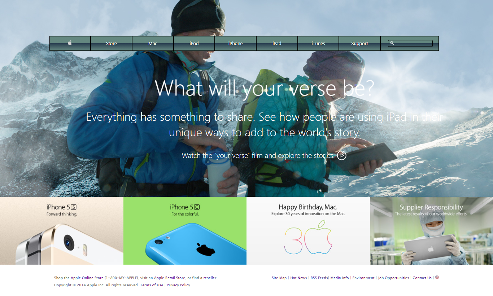

# apple-main-webpage-

# Apple first Home page CSS background image and gradients project

## Definition

This project is about cloning the Apple first home page. It has the tile of the page shown very bold and discriptive picture. some other promo images are also embeded gradient and background images are porperly used along with other elements. Below are other features of the page.

## About the Project

This project is about building a cloned of Apple page [The Apple Home Page: Apple Home Page](https://web.archive.org/web/20140301004610/http://www.apple.com/)

- It has embedded images

The features of this project are listed as below:

1. Have a nav section
   - With embedded images and videos
   - With embedded section with grid layout
2. Have a Promo section
   - Promo Pictures
3. Apple Page nav section
   - Nav links to many other pages aligned in a flex row direction
4. Has a footer with
   - Nav links to Legal, Privacy and Security
   - Copy right information statement

## Built With

- HTML5
- CSS3

## Live Demo

[Live Demo Link](https://raw.githack.com/henatan99/apple-main-webpage-/featured-branch/index.html)

## Getting Started

**Just clone this repo and open index.html file in your browser then you are good to go.**

## Authors

👤 **Henok Mossissa**

- GitHub: [@henatan99](https://github.com/henatan99)
- Twitter: [@henatan99](https://twitter.com/henatan99)
- LinkedIn: [Henok Mossissa](https://www.linkedin.com/in/henok-mekonnen-2a251613/)

👤 **Uchenna Anya**

- GitHub: [@uchennaanya](https://github.com/uchennaanya)
- Twitter: [@martinsanya19](https://twitter.com/martinsanya19)
- LinkedIn: [Uchenna Anya](https://www.linkedin.com/in/uchenna-anya/)

## 🤝 Contributing

Contributions, issues, and feature requests are welcome!

## Show your support

Give a ⭐️ if you like this project!

## Acknowledgments

- icons used from [iconify](https://fontawesome.com/)
- And every other images like hero image where downloaded from the the times official site

## 📝 License

This project is [MIT](./LICENSE) licensed.
